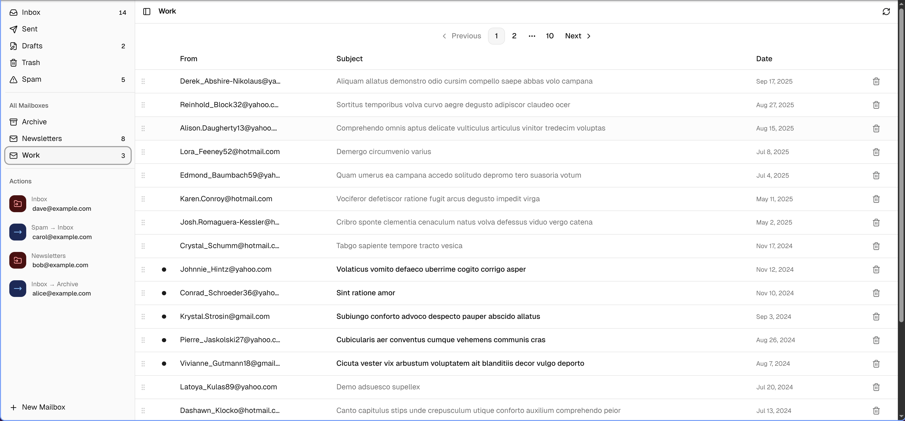

# CleanMail

[](https://github.com/blackboardsh/electrobun)
[](https://react.dev)
[](https://www.typescriptlang.org)
[](https://tanstack.com)
[](https://tailwindcss.com)
[](https://biomejs.dev)

**Simple app to clean your mailboxes easily.**

CleanMail is a local-first desktop app that connects to any IMAP mail server and helps you bulk-triage and clean up your inboxes — without any cloud, subscription, or privacy trade-off.

> **National Day of Clean** — observed every year on **March 19**, this is the perfect occasion to finally tackle that inbox with 12,000 unread emails.

---



---

## Features

- **IMAP account support** — connect to any mail server; credentials stored securely in the OS keychain
- **Mailbox sidebar** — pinned important folders (Inbox, Sent, Drafts, Trash, Spam…) with live unread counts
- **Read emails** — full HTML rendering in a sandboxed iframe, with plain-text fallback
- **Delete emails** — smart delete moves to Trash first, or permanently removes if already there
- **Drag & drop** — drag an email onto any sidebar mailbox to move it instantly
- **Action system** — every move or delete auto-records a reusable rule: *"always move all emails from this sender to that folder"*
- **Bulk apply** — run an action to move or delete every matching email from a sender in one shot

---

## Getting Started

```bash
# Install dependencies
bun install

# Run in development (HMR + app)
bun run start
```

> Requires [Bun](https://bun.sh).

On first launch, click the settings icon in the top bar to enter your IMAP credentials.

---
